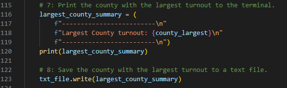

# Election_Analysis

## Project Overview
A Colorado Board of Elections employee has given you the following tasks to complete the election audit of a recent local congressional election.

1. Calculate the total number of votes cast.
2. Get a complete list of candidates who received votes.
3. Calculate the total number of votes each candidate received.
4. Calculate the percentage of votes each candidate won.
5. Determine the winner of the election based on popular vote.

## Resources
- Data Source: election_results.csv
- Software: Python 3.7.6, Visual Studio Code, 1.67.1

## Summary
The analysis of the election shows that:
- There were 369,711 votes cast in the election.
- The candidates were:
   - Charles Casper Stockham
   - Diana DeGette
   - Raymon Anthony Doane
- The candidate results were:
   - Charles Casper Stockham received 23.0% of the vote and 85,213 votes.
   - Diana DeGette received 73.8% of the vote and 272,892 votes.
   - Raymon Anthony Doane received 3.1% of the vote and 11,606 votes.

The winner of the election was:
  - Diana DeGette, who received 73.8% of the vote with 272,892 votes.

## Challenge Overview
The Colorado Board of Elections employee has requested additional information for the election audit of the congressional election.

1. The voter turnout for each county.
2. The percentage of votes from each county out of the total votes.
3. The county with the highest turnout.

## Challenge Summary
### Election audit results
* A total of 369,711 votes were cast in the election.
* Votes by county:
  
   
  
* The largest voter turnout was in Denver County
* Candidate total votes and percentages:

   

* The winning candidate was:

   

### Election audit summary
The attached script can easily be modified for use in future elections. Sample modifications include:
* For city elections the following sections can easily be modified by replacing county with city:
   
   
   
   
   
   
   
   
   
   
   
   
Please let us know if you need any additional changes and we look forward to working with you on future elections.
